# Message Handler Flow Diagram

This diagram shows the complete decision tree for how messages are processed in the WhatsApp bot.

## Main Flow Overview

```mermaid
flowchart TD
    Start([📱 Message Arrives]) --> HandleMessage[handleMessage - L66]
    
    %% Group Message Check
    HandleMessage --> IsGroup{Is Group Message?<br/>L71}
    IsGroup -->|Yes| CheckMention{Contains 'bot'<br/>or '@bot'?<br/>L72-73}
    CheckMention -->|No + No Image| ReturnNull1[❌ Return null<br/>L76]
    CheckMention -->|Yes but empty| ReturnGroupMention[📢 Group Mention Response<br/>L80]
    CheckMention -->|Yes| CheckImage1{Has Image?<br/>L85}
    IsGroup -->|No| CheckImage1
    
    %% Image vs Text
    CheckImage1 -->|Yes| HandleImageMsg[handleImageMessage<br/>L86]
    CheckImage1 -->|No| CheckEmpty{Message Empty?<br/>L90}
    CheckEmpty -->|Yes| ReturnNull2[❌ Return null<br/>L91]
    CheckEmpty -->|No| HandleTextMsg[handleTextMessage<br/>L94]
    
    %% Image Processing Flow
    HandleImageMsg --> GetSessionImg[getOrCreateSession<br/>L507<br/>↳ session-manager]
    GetSessionImg --> HasSessionImg{Session exists?<br/>L509}
    HasSessionImg -->|No| ReturnLogin1[🔐 Login Prompt<br/>L510]
    HasSessionImg -->|Yes| ExtractOCR[extractExpenseFromImage<br/>L517<br/>↳ ocr/image-processor]
    ExtractOCR --> HasExpenses{Expenses Found?<br/>L519}
    HasExpenses -->|No| ReturnOCRError[❌ OCR No Data<br/>L520]
    HasExpenses -->|Yes| MultipleExpenses{Multiple?<br/>L524}
    MultipleExpenses -->|Yes| ExecuteMultiImg[executeIntent with<br/>transactions array<br/>L540]
    MultipleExpenses -->|No| MergeCaption[Merge with caption<br/>if provided<br/>L566-582]
    MergeCaption --> ExecuteSingleImg[executeIntent<br/>L584]
    ExecuteMultiImg --> ReturnImgResults[✅ Return Results<br/>L543-546]
    ExecuteSingleImg --> ReturnImgResults
    
    %% Text Processing Flow
    HandleTextMsg --> CheckCorrectionState{hasCorrectionState?<br/>L99<br/>↳ correction-state}
    CheckCorrectionState -->|Yes| HandleCorrection[handleUserCorrection<br/>L100]
    CheckCorrectionState -->|No| CheckDuplicate{hasPendingTransaction?<br/>L104<br/>↳ duplicate-confirmation}
    
    CheckDuplicate -->|Yes| HandleDuplicateConf[handleDuplicateConfirmation<br/>L105<br/>↳ duplicate-confirmation]
    CheckDuplicate -->|No| DetectCorrection[detectCorrectionIntent<br/>L109<br/>↳ correction-detector]
    
    DetectCorrection --> IsCorrectionIntent{Action != 'unknown'<br/>AND confidence >= 0.5?<br/>L110}
    IsCorrectionIntent -->|Yes| HandleTransCorrection[handleTransactionCorrection<br/>L111<br/>↳ transaction-corrections]
    IsCorrectionIntent -->|No| ParseCommand[parseCommand<br/>L115<br/>↳ command-parser]
    
    %% Command Parsing
    ParseCommand --> IsCommand{Command Found?<br/>L116}
    IsCommand -->|Yes| IsHelp{Command = 'help'?<br/>L118}
    IsHelp -->|Yes| ReturnHelp1[📖 Return Help<br/>L119<br/>↳ command-parser]
    IsHelp -->|No| GetSessionCmd[getOrCreateSession<br/>L123]
    GetSessionCmd --> HasSessionCmd{Session exists?<br/>L124}
    HasSessionCmd -->|No| ReturnLogin2[🔐 Login Prompt<br/>L125]
    HasSessionCmd -->|Yes| ExecuteCmd[executeCommand<br/>L130<br/>↳ command-parser]
    ExecuteCmd --> IntentFromCmd{Intent returned?<br/>L131}
    IntentFromCmd -->|Yes| ExecIntent1[executeIntent<br/>L132]
    IntentFromCmd -->|No| ContinueFlow1[Continue to next step]
    
    %% Learned Patterns
    IsCommand -->|No| GetSessionPat[getOrCreateSession<br/>L138]
    ContinueFlow1 --> GetSessionPat
    GetSessionPat --> HasSessionPat{Session exists?<br/>L139}
    HasSessionPat -->|Yes| GetPatterns[getUserPatterns<br/>L142<br/>↳ pattern-storage]
    GetPatterns --> MatchPattern[matchLearnedPattern<br/>L143<br/>↳ pattern-storage]
    MatchPattern --> IsMatch{Pattern matched?<br/>L144}
    IsMatch -->|Yes| ExecIntent2[executeIntent<br/>L145]
    IsMatch -->|No| LocalNLP[parseIntent<br/>L151<br/>↳ intent-parser]
    HasSessionPat -->|No| LocalNLP
    
    %% Local NLP
    LocalNLP --> IsLogin{Action = 'login'?<br/>L154}
    IsLogin -->|Yes| HandleLoginFlow[handleLogin<br/>L155<br/>↳ handlers/auth]
    IsLogin -->|No| IsHelpLocal{Action = 'help'?<br/>L158}
    IsHelpLocal -->|Yes| ReturnWelcome[📖 Welcome Message<br/>L159]
    IsHelpLocal -->|No| NeedAuth{Action != 'unknown'<br/>AND no session?<br/>L163}
    NeedAuth -->|Yes| GetSessionAuth[getOrCreateSession<br/>L164]
    GetSessionAuth --> HasSessionAuth{Session exists?<br/>L165}
    HasSessionAuth -->|No| ReturnLogin3[🔐 Login Prompt<br/>L166]
    HasSessionAuth -->|Yes| CheckConfidence{Confidence >= 0.8?<br/>L175}
    NeedAuth -->|No| CheckConfidence
    CheckConfidence -->|Yes| ExecIntent3[executeIntent<br/>L176]
    
    %% AI Pattern Generation
    CheckConfidence -->|No| HasOpenAI{OPENAI_API_KEY<br/>AND session?<br/>L181}
    HasOpenAI -->|No| ReturnUnknown[❓ Unknown Command<br/>L222]
    HasOpenAI -->|Yes| GetUserContext[getUserContext<br/>L183<br/>↳ ai-pattern-generator]
    GetUserContext --> ParseAI[parseWithAI<br/>L184<br/>↳ ai-pattern-generator]
    ParseAI --> StoreCorrection[storeCorrectionState<br/>L187<br/>↳ correction-state]
    StoreCorrection --> ExecIntent4[executeIntent<br/>L190]
    ExecIntent4 --> GeneratePattern[generatePattern<br/>L194<br/>↳ ai-pattern-generator]
    GeneratePattern --> SavePattern[savePattern<br/>L195<br/>↳ ai-pattern-generator]
    SavePattern --> ReturnAISuccess[✅ Return with<br/>'Processado via IA'<br/>L200-212]
    
    %% User Correction Flow
    HandleCorrection --> GetSessionCorr[getOrCreateSession<br/>L440]
    GetSessionCorr --> HasSessionCorr{Session exists?<br/>L441}
    HasSessionCorr -->|No| ReturnLogin4[🔐 Login Prompt<br/>L442]
    HasSessionCorr -->|Yes| GetCorrState[getAndClearCorrectionState<br/>L445<br/>↳ correction-state]
    GetCorrState --> HasCorrState{State found?<br/>L446}
    HasCorrState -->|No| ReturnCorrError[❌ Context not found<br/>L447]
    HasCorrState -->|Yes| ParseCorrection[parseUserCorrection<br/>L453<br/>↳ ai-pattern-generator]
    ParseCorrection --> IsCorrValid{Valid correction?<br/>L455}
    IsCorrValid -->|No| ReturnCorrInvalid[❌ Cannot understand<br/>L456]
    IsCorrValid -->|Yes| ExecCorrIntent[executeIntent<br/>L460]
    ExecCorrIntent --> CreateCorrPattern[createCorrectedPattern<br/>L464<br/>↳ ai-pattern-generator]
    CreateCorrPattern --> SaveCorrPattern[savePattern<br/>L471<br/>↳ ai-pattern-generator]
    SaveCorrPattern --> ReturnCorrSuccess[✅ Correction Applied<br/>L473-492]
    
    %% Execute Intent Flow
    ExecIntent1 --> ExecuteIntentStart
    ExecIntent2 --> ExecuteIntentStart
    ExecIntent3 --> ExecuteIntentStart
    ExecIntent4 --> ExecuteIntentStart
    ExecCorrIntent --> ExecuteIntentStart
    
    ExecuteIntentStart[executeIntent - L281] --> CheckPermMap{Get required permission<br/>from ACTION_PERMISSION_MAP<br/>L228-256, L283}
    CheckPermMap --> HasPermRequired{Permission required?<br/>L285}
    HasPermRequired -->|Yes| CheckAuth[checkAuthorization<br/>L286<br/>↳ middleware/authorization]
    CheckAuth --> IsAuthorized{Authorized?<br/>L288}
    IsAuthorized -->|No| ReturnUnauth[🚫 Unauthorized Number<br/>L289]
    IsAuthorized -->|Yes| HasPerm[hasPermission<br/>L292<br/>↳ middleware/authorization]
    HasPerm --> PermGranted{Permission granted?<br/>L292}
    PermGranted -->|No| ReturnPermDenied[🚫 Permission Denied<br/>L293-294]
    
    PermGranted -->|Yes| CheckMultiTrans{Multiple transactions?<br/>L299}
    HasPermRequired -->|No| CheckMultiTrans
    CheckMultiTrans -->|Yes| HandleMultiple[handleMultipleTransactions<br/>L300]
    CheckMultiTrans -->|No| CheckPaymentSugg{action = 'add_expense'<br/>AND category<br/>AND no paymentMethod?<br/>L304}
    
    CheckPaymentSugg -->|Yes| GetSuggestedPM[getSuggestedPaymentMethod<br/>L309-314<br/>↳ pattern-storage]
    CheckPaymentSugg -->|No| RouteAction[Route to handler<br/>based on action<br/>L325-398]
    GetSuggestedPM --> RouteAction
    
    %% Action Routing
    RouteAction --> ActionSwitch{Action Type?<br/>L325}
    ActionSwitch -->|logout| Logout[handleLogout<br/>L327<br/>↳ handlers/auth]
    ActionSwitch -->|add_expense/income| AddExpense[handleAddExpense<br/>L331<br/>↳ handlers/expenses]
    AddExpense --> LearnPayment[Learn payment preference<br/>L334-353<br/>↳ pattern-storage]
    LearnPayment --> ReturnExpenseResult[Return result]
    
    ActionSwitch -->|show_expenses| ShowExp[handleShowExpenses<br/>L358<br/>↳ handlers/expenses]
    ActionSwitch -->|set_budget| SetBudget[handleSetBudget<br/>L361<br/>↳ handlers/budgets]
    ActionSwitch -->|show_budget| ShowBudget[handleShowBudgets<br/>L364<br/>↳ handlers/budgets]
    ActionSwitch -->|add_recurring| AddRec[handleAddRecurring<br/>L367<br/>↳ handlers/recurring]
    ActionSwitch -->|show_recurring| ShowRec[handleShowRecurring<br/>L370<br/>↳ handlers/recurring]
    ActionSwitch -->|delete_recurring| DelRec[handleDeleteRecurring<br/>L373<br/>↳ handlers/recurring]
    ActionSwitch -->|show_report| ShowReport[handleShowReport<br/>L376<br/>↳ handlers/reports]
    ActionSwitch -->|list_categories| ListCat[handleListCategories<br/>L379<br/>↳ handlers/categories]
    ActionSwitch -->|add_category| AddCat[handleAddCategory<br/>L382<br/>↳ handlers/categories]
    ActionSwitch -->|list_transactions| ListTrans[handleShowExpenses<br/>L385<br/>↳ handlers/expenses]
    ActionSwitch -->|list_recurring| ListRecurring[handleShowRecurring<br/>L388<br/>↳ handlers/recurring]
    ActionSwitch -->|list_budgets| ListBudgets[handleShowBudgets<br/>L391<br/>↳ handlers/budgets]
    ActionSwitch -->|show_help| ShowHelp[getCommandHelp<br/>L394<br/>↳ command-parser]
    ActionSwitch -->|default| UnknownAction[Unknown Command<br/>L397]
    
    %% Multiple Transactions Flow
    HandleMultiple --> LoopTrans[Loop through transactions<br/>L412-428]
    LoopTrans --> CallAddExpense[Call handleAddExpense<br/>for each<br/>L421<br/>↳ handlers/expenses]
    CallAddExpense --> ReturnMultiResults[Return array of messages<br/>L431-433]
    
    style Start fill:#e1f5ff
    style ReturnNull1 fill:#ffebee
    style ReturnNull2 fill:#ffebee
    style ReturnLogin1 fill:#fff3e0
    style ReturnLogin2 fill:#fff3e0
    style ReturnLogin3 fill:#fff3e0
    style ReturnLogin4 fill:#fff3e0
    style ReturnUnknown fill:#ffebee
    style ReturnUnauth fill:#ffcdd2
    style ReturnPermDenied fill:#ffcdd2
    style ReturnAISuccess fill:#c8e6c9
    style ReturnCorrSuccess fill:#c8e6c9
    style ReturnImgResults fill:#c8e6c9
    style ReturnExpenseResult fill:#c8e6c9
    
    style HandleMessage fill:#bbdefb
    style HandleTextMsg fill:#bbdefb
    style HandleImageMsg fill:#bbdefb
    style ExecuteIntentStart fill:#bbdefb
    style HandleCorrection fill:#bbdefb
```

## Key Decision Points

### 1. **Message Entry (L66-95)**
- **Group Messages**: Only responds if message contains "bot" or "@bot"
- **Image Messages**: Routes to OCR processing
- **Text Messages**: Routes to main text processing logic
- **Comprehensive Logging**: All message entries are logged with context

### 2. **Text Processing Strategy (L97-222)** - 4 LAYERS (SIMPLIFIED)
The system tries multiple strategies in order, with fallbacks. **All attempts are tracked in metrics.**

1. **Correction State** (L99-113)
   - Highest priority: if user is in correction mode
   - Uses: `correction-state` module
   - Metrics: Recorded with strategy `correction_state`

2. **Duplicate Confirmation** (L116-128)
   - Second priority: if waiting for duplicate transaction confirmation
   - Uses: `duplicate-confirmation` module
   - Metrics: Recorded with strategy `duplicate_confirmation`

3. **Correction Intent Detection** (L131-145)
   - Detects if user is trying to correct a previous transaction
   - Uses: `correction-detector` service
   - Metrics: Recorded with strategy `correction_intent`

4. **Local NLP with Command Parsing** (L148-215) - **MERGED LAYER**
   - **NEW**: Explicit commands (`/add`, `/budget`, etc.) are now handled by intent-parser
   - Commands have confidence 0.95+ and execute immediately
   - Natural language processing handles everything else
   - Works for login and help WITHOUT authentication
   - **Early Permission Check**: Permissions checked BEFORE execution/AI parsing (L193-216)
   - Requires confidence >= 0.8 to execute
   - Uses: `intent-parser` module (command-parser merged in)
   - Metrics: Recorded with strategy `explicit_command` or `local_nlp`

5. **Learned Patterns** (L219-247)
   - Matches against user's previously learned patterns
   - Requires authentication
   - Uses: `pattern-storage` module
   - Metrics: Recorded with strategy `learned_pattern`

6. **AI Pattern Generation** (L250-401) - **LAST RESORT**
   - Uses OpenAI to parse complex messages
   - **NEW**: Early permission check BEFORE execution (L276-300)
   - Executes intent with error handling
   - **Pattern Save Validation**: Only saves patterns if execution succeeds (L310-335)
   - Stores correction state for user feedback
   - **Feature Flag**: Feedback messages controlled by `SHOW_PARSING_FEEDBACK` (default: false)
   - Metrics: Recorded with strategy `ai_pattern` including execution success/failure

7. **Unknown Command** (L403-422)
   - Final fallback if nothing works
   - Metrics: Recorded with strategy `unknown`

### 3. **Intent Execution (L281-398)**

**Permission Checks** (L283-296):
- Maps actions to required permissions using `ACTION_PERMISSION_MAP`
- Checks authorization via `middleware/authorization`
- Returns permission denied if insufficient

**Special Processing**:
- **Multiple Transactions** (L299-301): Loops through array
- **Payment Method Suggestion** (L304-322): Auto-suggests based on category history
- **Payment Method Learning** (L334-353): Records user preferences

**Action Routing** (L325-398):
- Routes to specific handlers based on action type
- Each handler is in its own module (auth, expenses, budgets, etc.)

### 4. **Image Processing (L501-591)**
- Extracts expenses using OCR
- Supports multiple expenses in one image
- Merges with caption data if provided
- Uses same `executeIntent()` for consistency

## External Dependencies

### Core Modules
- **`nlp/intent-parser`**: **UPDATED** - Local NLP parsing + explicit commands (merged from command-parser)
- **`nlp/pattern-storage`**: User pattern matching & learning
- **`nlp/ai-pattern-generator`**: OpenAI-based parsing
- **`nlp/correction-state`**: In-memory correction state
- **`ocr/image-processor`**: Receipt OCR extraction

### Handlers
- **`handlers/auth`**: Login/logout
- **`handlers/expenses`**: Add/show transactions
- **`handlers/budgets`**: Budget management
- **`handlers/recurring`**: Recurring transactions
- **`handlers/reports`**: Reports generation
- **`handlers/categories`**: Category management
- **`handlers/duplicate-confirmation`**: Duplicate detection
- **`handlers/transaction-corrections`**: Transaction editing

### Services
- **`auth/session-manager`**: Session management
- **`middleware/authorization`**: Permission checks
- **`services/correction-detector`**: Correction intent detection
- **`services/supabase-client`**: Database access
- **`services/logger`**: **NEW** - Structured logging with levels and context
- **`services/metrics-tracker`**: **NEW** - Parsing metrics recording and analysis

## Recent Improvements ✅

### Fixed Issues

1. **✅ Command Parser Simplified**
   - Merged command-parser.ts into intent-parser.ts
   - Explicit commands (`/add`, `/budget`) now handled in unified flow
   - Single responsibility: intent-parser handles ALL parsing
   - Reduces confusion between command vs NLP parsing

2. **✅ Pattern Validation Fixed**
   - AI patterns now ONLY saved if execution succeeds
   - Prevents learning incorrect patterns
   - Try-catch around executeIntent tracks failures
   - Metrics record execution success/failure

3. **✅ Early Permission Checks**
   - Permissions now checked BEFORE heavy AI processing
   - Saves API costs for unauthorized users
   - Better error messages earlier in the flow
   - Applies to both local NLP and AI parsing

4. **✅ Comprehensive Logging**
   - All decision points logged with structured logger
   - Context includes: whatsappNumber, userId, action, strategy, duration
   - Easier debugging and monitoring
   - Replaces all console.log/error calls

5. **✅ Metrics Tracking**
   - Every message processing attempt recorded in database
   - Tracks: strategy used, success/failure, timing, permissions
   - Enables data-driven optimization
   - See METRICS.md for analysis queries

6. **✅ User Feedback Toggle**
   - `SHOW_PARSING_FEEDBACK` constant controls visibility
   - Currently set to `false` (hidden from users)
   - Easy to enable for testing or user feedback
   - Reduces message clutter

### 🟡 Remaining Considerations

1. **Language Mixing** (Partially Addressed):
   - i18n framework created (see INTERNATIONALIZATION.md)
   - Backend supports pt-br and en locales
   - Current code still uses direct pt-br imports
   - Future: Refactor handlers to use dynamic locale selection

2. **Multiple fallback layers** (Now Tracked):
   - Still have 7 parsing strategies
   - BUT: Now logged and measured via metrics
   - Can use data to optimize order and effectiveness
   - Clear visibility into which strategy is used

### 🟢 Strengths

1. **Auto-authentication** (L47-64, L123, L138):
   - Seamless user experience
   - Checks authorization automatically

2. **Learning system** (L142-148, L194-195):
   - Adapts to user patterns
   - Gets smarter over time

3. **Correction flow** (L99-101, L439-498):
   - Users can correct AI mistakes
   - System learns from corrections

4. **Multiple transaction support** (L299-301, L405-434):
   - Can process batches efficiently

## Implementation Status

| Recommendation | Status | Details |
|----------------|--------|---------|
| Standardize language | 🟡 Partial | i18n framework created, handlers need refactoring |
| Add logging | ✅ Complete | Structured logger integrated throughout |
| Early permission check | ✅ Complete | Checks before AI parsing and execution |
| Pattern validation | ✅ Complete | Only saves on successful execution |
| User feedback | ✅ Complete | Controlled by `SHOW_PARSING_FEEDBACK` flag |
| Simplify layers | ✅ Complete | Command parser merged into intent-parser |
| Add metrics | ✅ Complete | Full metrics tracking and analysis system |

## New Documentation

- **INTERNATIONALIZATION.md**: Complete i18n guide for backend and future FE integration
- **METRICS.md**: Comprehensive guide for querying and analyzing parsing metrics
- **MESSAGE_HANDLER_FLOW.md**: This file, updated with all changes

